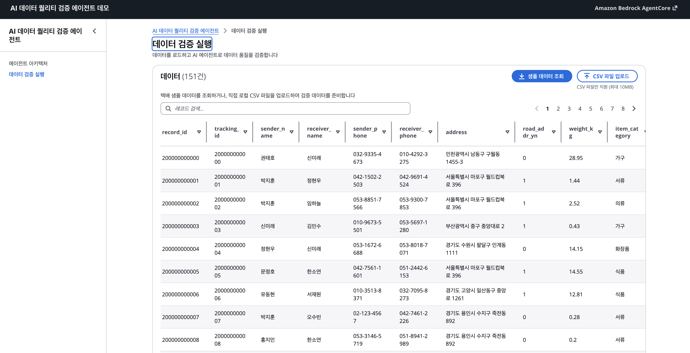
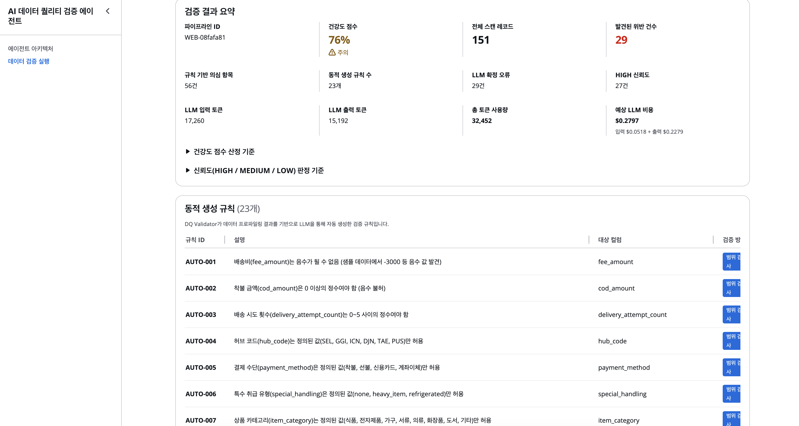
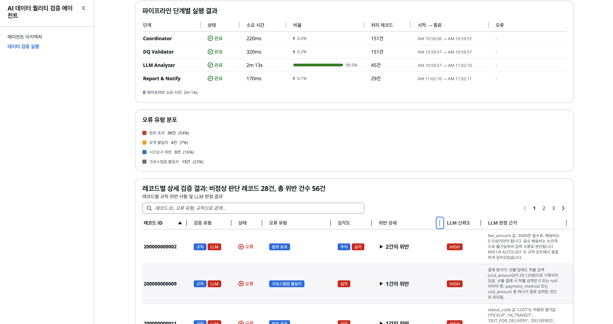

# AI Data Quality Agent on Amazon Bedrock

AI-powered Data Quality validation agent built with [Strands Agents SDK](https://github.com/strands-agents/sdk-python) and [Amazon Bedrock](https://aws.amazon.com/bedrock/). Deploys to [Amazon Bedrock AgentCore](https://docs.aws.amazon.com/bedrock-agentcore/latest/devguide/) with a web dashboard for interactive validation.

## Architecture

```
coordinator → profiler → schema_analyzer → rule_validator
                                                ↓
              correction ← report_notify ← semantic_analyzer
```

**7-node agent pipeline** with conditional routing:

| Node | Type | Role |
|------|------|------|
| coordinator | Deterministic | Extract data from DynamoDB Stream / S3, initialize pipeline |
| profiler | Autonomous Agent | Per-column statistical profiling + trend detection |
| schema_analyzer | Autonomous Agent | Schema inference + rule mapping + **dynamic rule generation** |
| rule_validator | Autonomous Agent | 8 static rules + dynamic rules, **strategy switching**, **delegation** |
| semantic_analyzer | Autonomous Agent | LLM semantic analysis + iterative reasoning + impact scoring |
| report_notify | Deterministic | Generate report (S3) + health score + Slack notification |
| correction | Deterministic | Apply approved corrections + quarantine bad data |

**33 tools** across validation, profiling, lineage, S3/DynamoDB, Slack, and more.

## Screenshots

### Data Validation — Sample Data Table

Load sample delivery data from S3 or upload your own CSV file to prepare data for validation.

### Validation Results — Summary & Dynamic Rules

Health score, LLM token usage, cost estimate, and auto-generated dynamic rules (AUTO-001 ~ AUTO-007).

### Validation Results — Pipeline Stages & Per-Record Details

Stage-by-stage execution timeline, error type distribution, and per-record validation details with LLM confidence and correction suggestions.

## Quick Start

### Prerequisites

- Python 3.12+
- Node.js 22+
- AWS CLI configured with credentials
- AWS account with Bedrock model access (Claude Sonnet)

### Option A: One-command setup

```bash
git clone https://github.com/HyeryeongJoo/bedrock-dq-agent.git
cd bedrock-dq-agent

# 1. Create .env and fill in your settings
cp .env.example .env
# Edit .env — at minimum set S3_STAGING_BUCKET

# 2. Run setup (installs deps, builds frontend, creates AWS resources, uploads sample data)
./setup.sh

# 3. Start
./web/start.sh
# Open http://localhost:8001
```

`setup.sh` will:
- Check prerequisites (Python, Node.js, AWS CLI, credentials)
- Install agent Python dependencies + create virtualenv
- Build the React frontend
- Create S3 buckets and DynamoDB tables
- Upload sample delivery data (100 records) to S3

Use `./setup.sh --skip-aws` to skip AWS resource creation.

### Option B: Step-by-step

```bash
# 1. Clone and configure
git clone https://github.com/HyeryeongJoo/bedrock-dq-agent.git
cd bedrock-dq-agent
cp .env.example .env        # Edit with your AWS settings

# 2. Set up the agent
cd agent
python3.12 -m venv .venv
source .venv/bin/activate
pip install -e ".[dev]"

# 3. Run tests
pytest tests/ -v

# 4. Create AWS resources (S3 buckets + DynamoDB tables)
cd ..
./scripts/setup-aws.sh

# 5. Upload sample data
./scripts/upload-sample-data.sh

# 6. Build frontend and start
cd web/frontend && npm install && npm run build && cd ../..
./web/start.sh              # Open http://localhost:8001
```

### Deploy to AWS (CloudFormation)

Deploy the full application stack to AWS with a single command. The included CloudFormation template provisions all infrastructure automatically.

#### What gets created

```
┌─────────────────────────────────────────────────────────┐
│                    CloudFront (HTTPS)                    │
│               https://xxxxx.cloudfront.net               │
└────────────────────────┬────────────────────────────────┘
                         │ Port 8001
┌────────────────────────▼────────────────────────────────┐
│  EC2 Instance (Amazon Linux 2023, Graviton m7g.medium)  │
│  ┌─────────────────────────────────────────────────┐    │
│  │  FastAPI Backend (uvicorn, systemd managed)      │    │
│  │  React Frontend (static files served by FastAPI) │    │
│  └─────────────────────────────────────────────────┘    │
└─────────────────────────────────────────────────────────┘
         │                              │
         ▼                              ▼
┌─────────────────┐     ┌──────────────────────────────┐
│  S3 Staging     │     │  Bedrock AgentCore Runtime   │
│  (data + report)│     │  (AI DQ validation pipeline) │
└─────────────────┘     └──────────────────────────────┘
```

| Resource | Detail |
|----------|--------|
| **VPC** | Dedicated VPC (10.4.0.0/16) with public subnet, IGW, route table |
| **EC2** | `m7g.medium` (ARM64 Graviton), 30GB gp3 EBS, encrypted |
| **Security Group** | Inbound only from CloudFront (AWS prefix list), port 8001 |
| **IAM Role** | EC2 role with SSM, CloudWatch, Bedrock, S3 access |
| **CloudFront** | HTTPS distribution with HTTP/2+3, caching disabled for API |
| **SSM Document** | Automated deployment: installs Python 3.12, Node.js 22, builds app |
| **Lambda (x2)** | Orchestration for SSM document execution and completion checking |

#### Prerequisites

- AWS CLI configured with credentials that have permissions to create CloudFormation stacks, VPC, EC2, IAM roles, CloudFront, Lambda, and SSM documents
- An S3 bucket for data staging (the pipeline reads/writes data and reports here)
- (Optional) A Bedrock AgentCore runtime ARN if running the agent via AgentCore

#### Deployment steps

```bash
# 1. Set required environment variables
export AWS_REGION=us-east-1
export S3_STAGING_BUCKET=my-staging-bucket          # Required: S3 bucket for data & reports

# 2. Set optional environment variables
export AGENT_RUNTIME_ARN=arn:aws:bedrock-agentcore:us-east-1:123456789012:runtime/my-agent-xxxxx
export DEPLOY_S3_BUCKET=my-deploy-bucket            # Defaults to dq-agent-web-deploy-<account-id>
export STACK_NAME=dq-agent-web                      # Defaults to dq-agent-web

# 3. Run deployment
./web/deploy.sh
```

The script will:
1. **Package** the application (backend + frontend source) into a tarball
2. **Create S3 bucket** for the deployment package (auto-derived from your AWS account ID if not specified)
3. **Upload** the package to S3
4. **Deploy CloudFormation stack** which provisions all infrastructure and runs the SSM document to install, build, and start the application on EC2

#### Verify deployment

```bash
# The script outputs the CloudFront URL and EC2 Instance ID
# Test the health endpoint:
curl https://<cloudfront-domain>.cloudfront.net/api/health
# Expected: {"status":"ok"}

# Open the web dashboard:
open https://<cloudfront-domain>.cloudfront.net
```

#### Update deployment

To deploy code changes to an existing stack, re-run `./web/deploy.sh`. If only application code changed (no CloudFormation template changes), you can redeploy directly to the EC2 instance via SSM:

```bash
# Upload new package to S3
aws s3 cp /tmp/dq-agent-web.tar.gz s3://<deploy-bucket>/dq-agent-web.tar.gz

# Redeploy on EC2 via SSM
aws ssm send-command \
  --instance-ids <instance-id> \
  --document-name "AWS-RunShellScript" \
  --parameters commands='[
    "aws s3 cp s3://<deploy-bucket>/dq-agent-web.tar.gz /tmp/dq-agent-web.tar.gz",
    "rm -rf /opt/dq-agent-web/backend /opt/dq-agent-web/frontend",
    "tar -xzf /tmp/dq-agent-web.tar.gz -C /opt/dq-agent-web",
    "cd /opt/dq-agent-web/frontend && npm ci && npm run build",
    "chown -R ec2-user:ec2-user /opt/dq-agent-web",
    "systemctl restart dq-agent-web"
  ]'
```

#### Clean up

```bash
# Delete the entire stack (VPC, EC2, CloudFront, IAM roles, etc.)
aws cloudformation delete-stack --stack-name dq-agent-web --region us-east-1

# Optionally remove the deployment S3 bucket
aws s3 rb s3://<deploy-bucket> --force
```

## Project Structure

```
bedrock-dq-agent/
├── agent/                    # Core AI DQ agent
│   ├── src/ai_dq_agent/     # Agent source code
│   │   ├── agents/           # 7-node pipeline (graph.py)
│   │   ├── models/           # Pydantic data models
│   │   ├── rules/            # Static validation rules (YAML)
│   │   └── tools/            # 33 @tool functions
│   ├── config/rules/         # Domain-specific rules
│   ├── tests/                # Unit + integration tests
│   ├── agentcore_agent.py    # AgentCore Runtime entry point
│   └── pyproject.toml
├── web/                      # Web dashboard
│   ├── backend/              # FastAPI API server
│   ├── frontend/             # React + Cloudscape UI
│   ├── start.sh              # Local development script
│   └── deploy.sh             # AWS deployment script
├── scripts/
│   ├── check-prereqs.sh      # Prerequisites checker
│   ├── setup-aws.sh          # Create S3 buckets + DynamoDB tables
│   └── upload-sample-data.sh # Upload test data to S3
├── infra/
│   └── cloudformation.yaml   # Full-stack CloudFormation template
├── setup.sh                  # One-command setup
├── .env.example              # Environment variable template
└── LICENSE                   # MIT
```

## Configuration

All configuration is via environment variables. See [`.env.example`](.env.example) for the full list.

Key variables:

| Variable | Description |
|----------|-------------|
| `AWS_REGION` | AWS region (default: `us-east-1`) |
| `S3_STAGING_BUCKET` | S3 bucket for data staging and pipeline artifacts |
| `AGENT_RUNTIME_ARN` | AgentCore runtime ARN (empty = direct invocation) |
| `SLACK_BOT_TOKEN` | Slack bot token for notifications (optional) |
| `BEDROCK_MODEL_ID` | Bedrock model ID (default: `global.anthropic.claude-sonnet-4-6`) |

## Execution Modes

1. **AgentCore Runtime** (recommended for production): Deploy the agent to Bedrock AgentCore and invoke via the runtime API. Set `AGENT_RUNTIME_ARN` in your environment.

2. **Direct Invocation** (development): The web backend imports and runs the pipeline directly. Leave `AGENT_RUNTIME_ARN` empty.

## License

[MIT](LICENSE)

---

[Korean documentation (한국어 문서)](README.ko.md)
