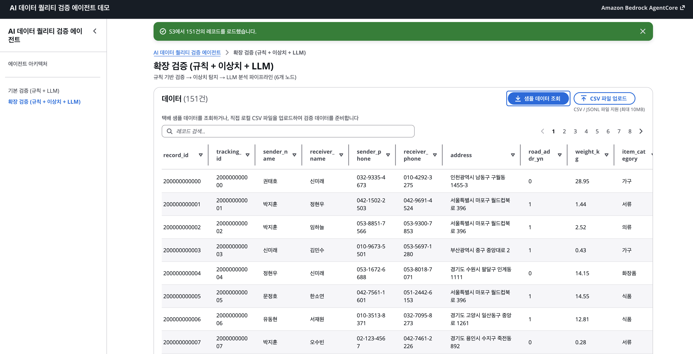
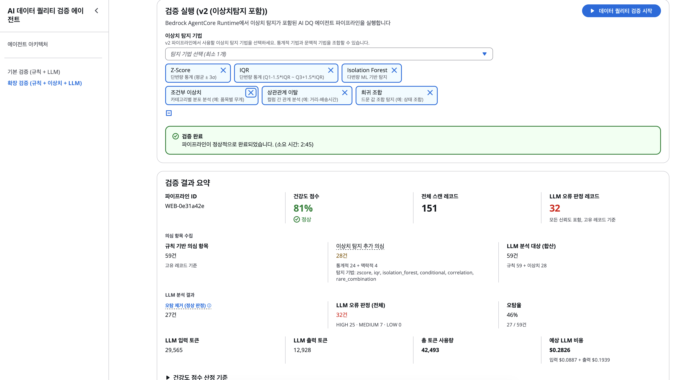
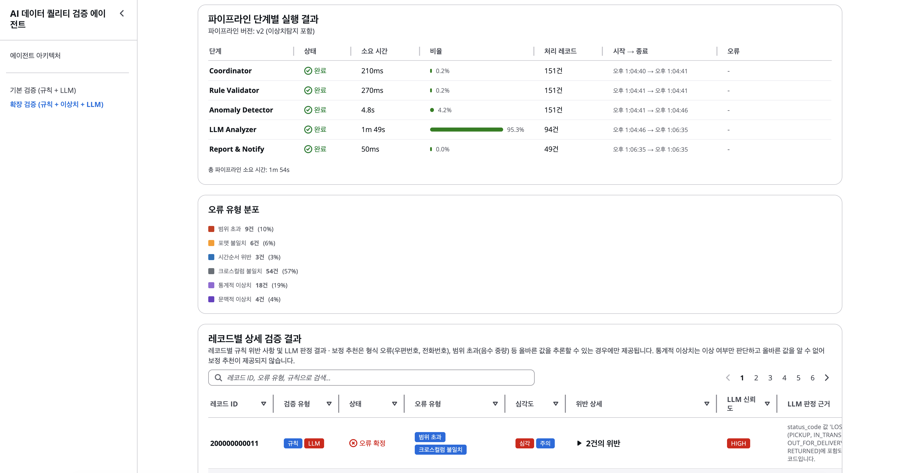
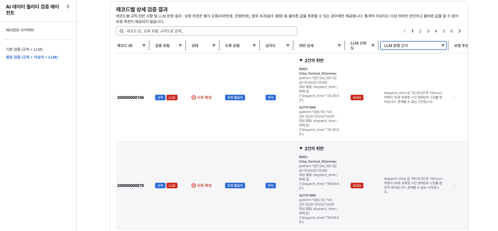
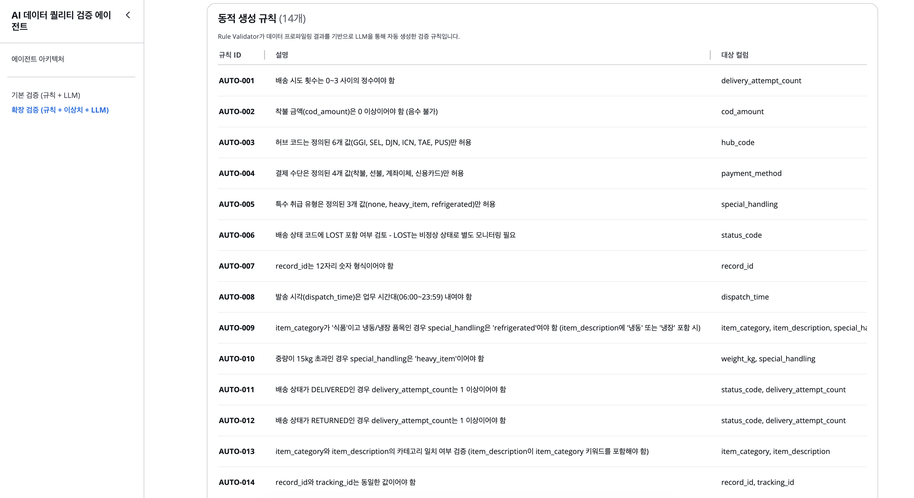

# AI Data Quality Agent on Amazon Bedrock

AI-powered Data Quality validation agent built with [Strands Agents SDK](https://github.com/strands-agents/sdk-python) and [Amazon Bedrock](https://aws.amazon.com/bedrock/). Deploys to [Amazon Bedrock AgentCore](https://docs.aws.amazon.com/bedrock-agentcore/latest/devguide/) with a web dashboard for interactive validation.

## Architecture

Two pipeline versions are available:

**v1 — Basic Validation (Rules + LLM)** — 5-node pipeline:
```
Coordinator ─(has data?)─► Rule Validator ─(suspects > 0?)─► LLM Analyzer → Report & Notify → Correction
                                                 │
                                          (no suspects)
                                                 └──────────────────────────► Report & Notify
```

**v2 — Extended Validation (Rules + Anomaly Detection + LLM)** — 6-node pipeline:
```
Coordinator ─(has data?)─► Rule Validator → Anomaly Detector ─(suspects > 0?)─► LLM Analyzer → Report & Notify → Correction
                                                                      │
                                                               (no suspects)
                                                                      └───────────────────────► Report & Notify
```

The pipeline uses **conditional routing** — nodes are skipped when not needed:

| Condition | Behaviour |
|-----------|-----------|
| No data found by Coordinator | Pipeline exits immediately; all downstream nodes skipped |
| Suspect count = 0 after Rule Validator (v1) or Anomaly Detector (v2) | LLM Analyzer skipped — no records to analyze |
| `dry_run = true` | Correction skipped — report only, no data modifications |

### Pipeline Nodes

| Node | Type | Role |
|------|------|------|
| **Coordinator** | Deterministic | Extract data from DynamoDB / S3, initialize pipeline state |
| **Rule Validator** | Hybrid (Deterministic + LLM) | Static rules (YAML) + LLM-generated dynamic rules, full-data profiling, deterministic full-scan |
| **Anomaly Detector** (v2 only) | Statistical | Z-Score, IQR, Isolation Forest, conditional outlier, correlation, rare combination detection |
| **LLM Analyzer** | LLM (Claude) | Semantic analysis of suspect records, error/false-positive classification with confidence (HIGH/MEDIUM/LOW), correction suggestions |
| **Report & Notify** | Deterministic | Generate DQ report (S3), compute health score, Slack notification |
| **Correction** | Deterministic | Human-in-the-Loop approval-based correction + quarantine |

### 4-Layer Validation

| Layer | Method | Example |
|-------|--------|---------|
| 1. Static Rules | Pre-defined YAML rules | Phone number pattern mismatch |
| 2. Dynamic Rules | LLM-generated rules from data profiling | "COD payment but delivery fee = 0" |
| 3. Anomaly Detection | Statistical algorithms (v2) | Delivery fee Z-Score 4.2 outlier |
| 4. LLM Analysis | Contextual semantic analysis | "0.005kg is normal for document delivery" → false positive removed |

**45 tools** across validation, profiling, rule generation, lineage, S3/DynamoDB, Slack, and more.

### Rule Validator: Static Rules + Dynamic Rules

The Rule Validator combines two complementary rule types to maximize coverage.

#### Static Rules (`agent/src/ai_dq_agent/rules/default_rules.yaml`)

Pre-defined business validation rules authored by domain experts. Deterministic — same input always produces the same result.

| Error Type | Validation Tool | Example |
|------------|-----------------|---------|
| `out_of_range` | `range_check` | `weight_kg` outside 0.01–30.0 kg, `status_code` not in allowed enum |
| `format_inconsistency` | `regex_validate` | Phone number pattern mismatch, tracking ID not 10–15 digits |
| `temporal_violation` | `timestamp_compare` | `delivery_time` earlier than `dispatch_time` |
| `cross_column_inconsistency` | `address_classify`, `value_condition` | Road address but `road_addr_yn=0`; COD payment but `cod_amount=0` |

Static rules catch known, well-defined errors quickly and cheaply. Their limitation: they cannot detect patterns that were never explicitly defined.

#### Dynamic Rules (LLM-generated at runtime, IDs: `AUTO-NNN`)

Claude analyzes full-data profiling statistics and generates new validation rules for patterns not covered by static rules. A two-round LLM process is used so that rules reflect the entire dataset distribution — not just a small sample:

```
Step 1  Schema inference + S3 cache check (SHA-256 fingerprint, TTL 1h)
        └─ Cache HIT  → skip steps 2–4, reuse rules (saves ~40s per run)
        └─ Cache MISS → continue

Step 2  LLM Round 1 (schema + 5 sample records)
        → "What cross-column conditions should we investigate?"
        → e.g. "COD payment AND delivery fee = 0", "distance vs. transit time ratio"

Step 3  Full-data profiling (no LLM — deterministic)
        → Column stats: null rate, unique count, top-value distribution
        → Cross-column condition match rates across all records

Step 4  LLM Round 2 (profiling results + 20 sample records)
        → "Generate new rules that don't duplicate existing ones."
        → Rules are grounded in the real data distribution, not just samples
        → Results cached to S3 (keyed by schema SHA-256 fingerprint)

Step 5  Deterministic full-scan
        → Apply ALL rules (static + dynamic) to every record
```

**LLM call summary** (per pipeline run):

| Stage | Calls | When | Purpose |
|-------|-------|------|---------|
| Rule Validator — Round 1 | 1 | Cache MISS only | Discover cross-column conditions to profile |
| Rule Validator — Round 2 | 1 | Cache MISS only | Generate dynamic rules from profiling stats |
| LLM Analyzer | ⌈suspects ÷ 50⌉ | Always (if suspects > 0) | PRIMARY analysis: in a **single response per batch**, LLM returns `is_error`, `confidence` (HIGH/MEDIUM/LOW), and `suggested_correction` together |
| **Total (cache MISS, ≤ 50 suspects)** | **3** | — | — |
| **Total (cache HIT, ≤ 50 suspects)** | **1** | — | — |

> **Note on confidence judgment**: Confidence (HIGH/MEDIUM/LOW) is **not** a separate LLM call. Explicit confidence criteria are baked into the PRIMARY system prompt, so the LLM determines error verdict and confidence in the same single call. No extra round-trip for confidence.

> **Core design principle — "LLM discovers, rules verify"**: LLM decides *what* patterns to validate; the actual record-level checking is performed by deterministic tool functions (`range_check`, `regex_validate`, `timestamp_compare`). This combines LLM's creative pattern discovery with the reproducibility of deterministic validation.

Why two LLM rounds instead of one? Generating rules directly from 5 sample records would reflect only a small slice of the data. The two-round approach forces a full-data profiling pass first so that the rules LLM generates are anchored to the real column distributions across all records.

### Anomaly Detector (v2 only): Statistical + Contextual Outlier Detection

The Anomaly Detector runs on the full dataset to find records that are statistically or contextually abnormal — patterns that rule-based checks cannot express as fixed min/max bounds or regex patterns.

| Method | Category | What it detects |
|--------|----------|-----------------|
| Z-Score | Statistical | Single-column values deviating more than 3σ from the mean |
| IQR | Statistical | Values outside Q1−1.5×IQR ~ Q3+1.5×IQR |
| Isolation Forest | Statistical (multivariate) | Multi-dimensional outliers using machine learning |
| Conditional outlier | Contextual | Values normal globally but abnormal within a sub-group (e.g., weight by item type) |
| Correlation deviation | Contextual | Values that violate expected relationships between columns (e.g., distance vs. transit time) |
| Rare combination | Contextual | Unusual co-occurrence of values across columns |

Suspects found by Anomaly Detector are merged with Rule Validator suspects before being passed to LLM Analyzer. Duplicate records are deduplicated automatically.

### LLM Analyzer: Semantic Analysis + Confidence Judgment

The LLM Analyzer (Claude Sonnet) receives only the suspect records collected by Rule Validator and Anomaly Detector — not the full dataset. It performs PRIMARY analysis in batches (default 50 records/call) to minimize API calls.

Each suspect is judged with an explicit confidence level defined in the system prompt:

| Confidence | Criteria | Example |
|------------|----------|---------|
| HIGH | Error can be determined from data alone | Format error (phone digits), obvious range violation (negative weight), logical contradiction (delivery before dispatch) |
| MEDIUM | Likely an error but business exceptions may exist | Boundary values, non-standard but potentially valid formats |
| LOW | Cannot be certain whether it is an error | Statistically rare but within valid range, context-dependent |

All confidence levels (HIGH/MEDIUM/LOW) are surfaced to the user — none are silently discarded.

**Health Score** is computed from LLM-confirmed errors, weighted by confidence:

```
weighted_error_rate = (HIGH errors × 1.0 + MEDIUM/LOW errors × 0.5) / total_records
health_score        = 1.0 − weighted_error_rate
```

Thresholds: ≥ 80% → Healthy | 50–79% → Warning | < 50% → Critical

## Screenshots

### Sample Data Table

Load sample delivery data from S3 or upload your own CSV file. Supports the extended pipeline (v2) with anomaly detection method selection (Z-Score, IQR, Isolation Forest, conditional, correlation, rare combination).

### Validation Results — Summary

Health score (81%), pipeline flow metrics (rule suspects → anomaly additions → LLM analysis targets → false positives removed → confirmed errors), false positive rate, and LLM token usage with cost estimate.

### Validation Results

Per-record 3-state status (confirmed error / normal / pending), all columns sortable, violation details with rule IDs, LLM confidence levels, and correction suggestions.

### Validation Results — Per-Record Details

Same view with additional anomaly-type records (statistical_anomaly, contextual_anomaly) surfaced by the Anomaly Detector, showing the expanded error type distribution unique to the v2 pipeline.

### Dynamic Rules (Auto-generated)

LLM-generated validation rules (AUTO-001 ~ AUTO-014) based on data profiling. Rules cover allowed value checks, format validation, cross-column consistency, and temporal constraints.

## Quick Start

### Prerequisites

- Python 3.12+
- Node.js 22+
- AWS CLI configured with credentials
- AWS account with Bedrock model access (Claude Sonnet)

### Option A: One-command setup

```bash
git clone https://github.com/HyeryeongJoo/bedrock-dq-agent.git
cd bedrock-dq-agent

# 1. Create .env and fill in your settings
cp .env.example .env
# Edit .env — at minimum set S3_STAGING_BUCKET

# 2. Run setup (installs deps, builds frontend, creates AWS resources, uploads sample data)
./setup.sh

# 3. Start
./web/start.sh
# Open http://localhost:8001
```

`setup.sh` will:
- Check prerequisites (Python, Node.js, AWS CLI, credentials)
- Install agent Python dependencies + create virtualenv
- Build the React frontend
- Create S3 buckets and DynamoDB tables
- Upload sample delivery data (100 records) to S3

Use `./setup.sh --skip-aws` to skip AWS resource creation.

### Option B: Step-by-step

```bash
# 1. Clone and configure
git clone https://github.com/HyeryeongJoo/bedrock-dq-agent.git
cd bedrock-dq-agent
cp .env.example .env        # Edit with your AWS settings

# 2. Set up the agent
cd agent
python3.12 -m venv .venv
source .venv/bin/activate
pip install -e ".[dev]"

# 3. Run tests
pytest tests/ -v

# 4. Create AWS resources (S3 buckets + DynamoDB tables)
cd ..
./scripts/setup-aws.sh

# 5. Upload sample data
./scripts/upload-sample-data.sh

# 6. Build frontend and start
cd web/frontend && npm install && npm run build && cd ../..
./web/start.sh              # Open http://localhost:8001
```

### Deploy to AgentCore

```bash
cd agent
agentcore deploy    # Direct code deploy to Bedrock AgentCore Runtime
agentcore status    # Check deployment status
```

### Deploy to AWS (CloudFormation)

Deploy the full web application stack to AWS with a single command. The included CloudFormation template provisions all infrastructure automatically.

#### What gets created

```
┌─────────────────────────────────────────────────────────┐
│                    CloudFront (HTTPS)                    │
│               https://xxxxx.cloudfront.net               │
└────────────────────────┬────────────────────────────────┘
                         │ Port 8001
┌────────────────────────▼────────────────────────────────┐
│  EC2 Instance (Amazon Linux 2023, Graviton m7g.medium)  │
│  ┌─────────────────────────────────────────────────┐    │
│  │  FastAPI Backend (uvicorn, systemd managed)      │    │
│  │  React Frontend (static files served by FastAPI) │    │
│  └─────────────────────────────────────────────────┘    │
└─────────────────────────────────────────────────────────┘
         │                              │
         ▼                              ▼
┌─────────────────┐     ┌──────────────────────────────┐
│  S3 Staging     │     │  Bedrock AgentCore Runtime   │
│  (data + report)│     │  (AI DQ validation pipeline) │
└─────────────────┘     └──────────────────────────────┘
```

| Resource | Detail |
|----------|--------|
| **VPC** | Dedicated VPC (10.4.0.0/16) with public subnet, IGW, route table |
| **EC2** | `m7g.medium` (ARM64 Graviton), 30GB gp3 EBS, encrypted |
| **Security Group** | Inbound only from CloudFront (AWS prefix list), port 8001 |
| **IAM Role** | EC2 role with SSM, CloudWatch, Bedrock, S3 access |
| **CloudFront** | HTTPS distribution with HTTP/2+3, caching disabled for API |
| **SSM Document** | Automated deployment: installs Python 3.12, Node.js 22, builds app |
| **Lambda (x2)** | Orchestration for SSM document execution and completion checking |

#### Prerequisites

- AWS CLI configured with credentials that have permissions to create CloudFormation stacks, VPC, EC2, IAM roles, CloudFront, Lambda, and SSM documents
- An S3 bucket for data staging (the pipeline reads/writes data and reports here)
- (Optional) A Bedrock AgentCore runtime ARN if running the agent via AgentCore

#### Deployment steps

```bash
# 1. Set required environment variables
export AWS_REGION=us-east-1
export S3_STAGING_BUCKET=my-staging-bucket          # Required: S3 bucket for data & reports

# 2. Set optional environment variables
export AGENT_RUNTIME_ARN=arn:aws:bedrock-agentcore:us-east-1:123456789012:runtime/my-agent-xxxxx
export DEPLOY_S3_BUCKET=my-deploy-bucket            # Defaults to dq-agent-web-deploy-<account-id>
export STACK_NAME=dq-agent-web                      # Defaults to dq-agent-web

# 3. Run deployment
./web/deploy.sh
```

The script will:
1. **Package** the application (backend + frontend source) into a tarball
2. **Create S3 bucket** for the deployment package (auto-derived from your AWS account ID if not specified)
3. **Upload** the package to S3
4. **Deploy CloudFormation stack** which provisions all infrastructure and runs the SSM document to install, build, and start the application on EC2

#### Verify deployment

```bash
# The script outputs the CloudFront URL and EC2 Instance ID
# Test the health endpoint:
curl https://<cloudfront-domain>.cloudfront.net/api/health
# Expected: {"status":"ok"}

# Open the web dashboard:
open https://<cloudfront-domain>.cloudfront.net
```

#### Clean up

```bash
# Delete the entire stack (VPC, EC2, CloudFront, IAM roles, etc.)
aws cloudformation delete-stack --stack-name dq-agent-web --region us-east-1

# Optionally remove the deployment S3 bucket
aws s3 rb s3://<deploy-bucket> --force
```

## Project Structure

```
bedrock-dq-agent/
├── agent/                    # Core AI DQ agent
│   ├── src/ai_dq_agent/     # Agent source code
│   │   ├── agents/           # Pipeline nodes (graph.py, coordinator, rule_validator, anomaly_detector, llm_analyzer, etc.)
│   │   ├── models/           # Pydantic data models
│   │   ├── rules/            # Static validation rules (YAML)
│   │   └── tools/            # 45 @tool functions
│   ├── config/rules/         # Domain-specific rules
│   ├── tests/                # Unit + integration tests
│   ├── agentcore_agent.py    # AgentCore Runtime entry point
│   └── pyproject.toml
├── web/                      # Web dashboard
│   ├── backend/              # FastAPI API server
│   ├── frontend/             # React + Cloudscape UI
│   ├── start.sh              # Local development script
│   └── deploy.sh             # AWS deployment script
├── scripts/
│   ├── check-prereqs.sh      # Prerequisites checker
│   ├── setup-aws.sh          # Create S3 buckets + DynamoDB tables
│   └── upload-sample-data.sh # Upload test data to S3
├── infra/
│   └── cloudformation.yaml   # Full-stack CloudFormation template
├── setup.sh                  # One-command setup
├── .env.example              # Environment variable template
└── LICENSE                   # MIT
```

## Configuration

All configuration is via environment variables. See [`.env.example`](.env.example) for the full list.

Key variables:

| Variable | Description |
|----------|-------------|
| `AWS_REGION` | AWS region (default: `us-east-1`) |
| `S3_STAGING_BUCKET` | S3 bucket for data staging and pipeline artifacts |
| `AGENT_RUNTIME_ARN` | AgentCore runtime ARN (empty = direct invocation) |
| `SLACK_BOT_TOKEN` | Slack bot token for notifications (optional) |
| `BEDROCK_MODEL_ID` | Bedrock model ID (default: `global.anthropic.claude-sonnet-5`) |

## Execution Modes

1. **AgentCore Runtime** (recommended for production): Deploy the agent to Bedrock AgentCore and invoke via the runtime API. Set `AGENT_RUNTIME_ARN` in your environment.

2. **Direct Invocation** (development): The web backend imports and runs the pipeline directly. Leave `AGENT_RUNTIME_ARN` empty.

## License

[MIT](LICENSE)

---

[Korean documentation (한국어 문서)](README.ko.md)
